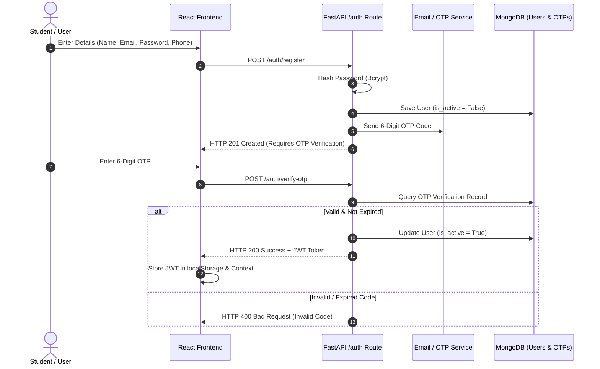
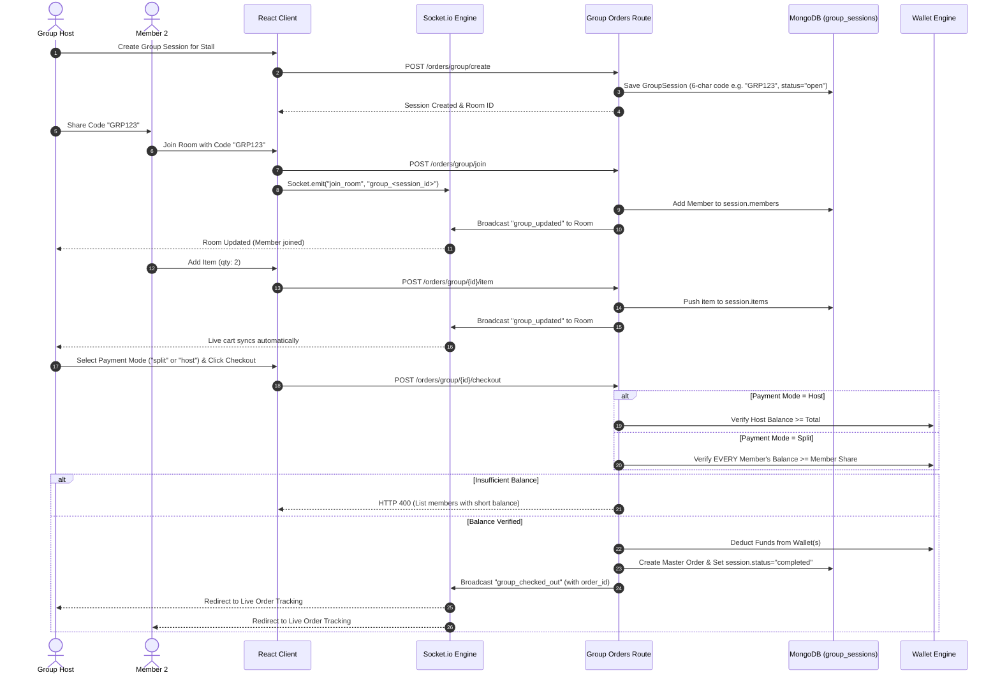
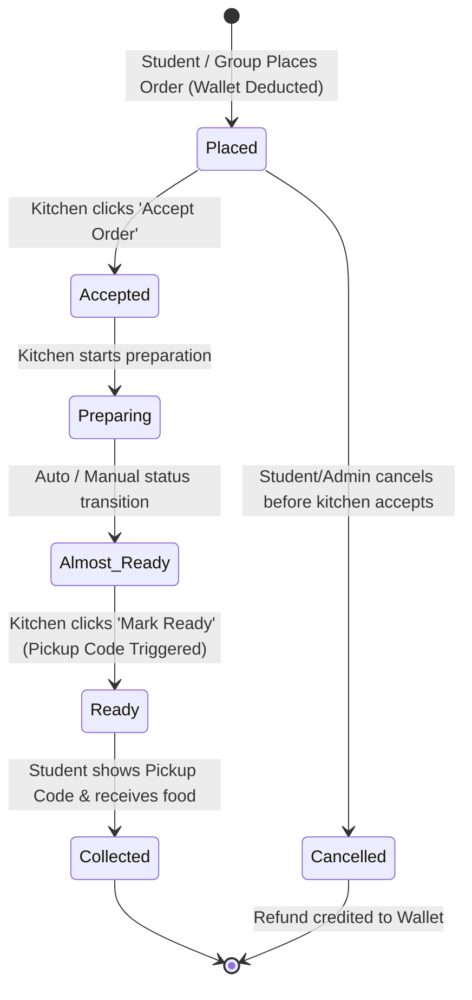

# Easy Eats — Complete Project Master Guide (Interview, Flowcharts & Architecture)

> **Document Purpose:** Single-source master documentation for **Easy Eats** — a high-performance, real-time campus food ordering and queue management platform. Designed specifically for **technical interviews, system design walkthroughs, architectural evaluation, and comprehensive code comprehension**.

---

## Table of Contents
1. [Project Overview & Business Problem](#1-project-overview--business-problem)
2. [Technology Stack & Key Rationale](#2-technology-stack--key-rationale)
3. [High-Level System Architecture](#3-high-level-system-architecture)
4. [Complete Flowcharts & Sequence Diagrams](#4-complete-flowcharts--sequence-diagrams)
   - [4.1 Authentication & Registration Flow](#41-authentication--registration-flow)
   - [4.2 AI Assistant & Smart Ordering Flow](#42-ai-assistant--smart-ordering-flow)
   - [4.3 Real-Time Group Ordering Flow](#43-real-time-group-ordering-flow)
   - [4.4 Kitchen Lifecycle & Order Tracking Flow](#44-kitchen-lifecycle--order-tracking-flow)
5. [Database Schema & Data Modeling (MongoDB + Beanie)](#5-database-schema--data-modeling-mongodb--beanie)
6. [Core Technical Subsystems & Deep Dives](#6-core-technical-subsystems--deep-dives)
   - [6.1 Groq-Powered AI Intent Extraction & Fuzzy Matcher](#61-groq-powered-ai-intent-extraction--fuzzy-matcher)
   - [6.2 Real-Time WebSocket Architecture](#62-real-time-websocket-architecture)
   - [6.3 Collaborative Group Ordering Engine](#63-collaborative-group-ordering-engine)
   - [6.4 Dynamic AI Preparation Time Estimator](#64-dynamic-ai-preparation-time-estimator)
   - [6.5 Campus Digital Wallet System](#65-campus-digital-wallet-system)
7. [API Routing Architecture Summary](#7-api-routing-architecture-summary)
8. [Comprehensive Interview Q&A (Top 20 Technical Questions)](#8-comprehensive-interview-qa-top-20-technical-questions)

---

## 1. Project Overview & Business Problem

### Problem Statement
On university campuses and food courts, food stalls face peak-hour congestion (lunch/dinner breaks). Traditional ordering systems cause:
- **Long Physical Queues:** Students lose 20–30 minutes standing in line.
- **Kitchen Bottlenecks:** Manual order entry leads to kitchen miscommunication and chaotic prep ordering.
- **Lack of ETA Visibility:** Students have no clear estimation of when their food will be ready.
- **Complex Group Dining:** Groups struggle with individual item entry and bill splitting.

### Solution: Easy Eats
**Easy Eats** is an end-to-end, async-first campus food ordering ecosystem offering:
1. **Multi-Stall Catalog:** Seamless browsing across multiple campus canteens.
2. **AI Ordering Assistant (EatsBot):** Natural language food discovery, automated cart building, and one-tap order placement.
3. **Collaborative Group Ordering:** Multi-user live cart synchronization over WebSockets with flexible Host-Pay or Split-Pay billing.
4. **Live Kitchen Order Flow:** WebSocket-powered kitchen dashboard for order status transitions.
5. **Dynamic Prep Time Prediction:** Heuristic queue algorithm calculating live ETA based on active stall workloads.
6. **Campus Wallet:** Instant payment processing without external gateway delays.

---

## 2. Technology Stack & Key Rationale

| Layer | Technology | Selection Rationale |
|---|---|---|
| **Backend Framework** | FastAPI (Python 3.11+) | Async native, high performance (`uvicorn` ASGI), auto OpenAPI documentation, strict Pydantic data validation. |
| **Database ODM** | MongoDB Atlas + Beanie | Schema flexibility for complex customizations; async Motor engine; low latency document reads. |
| **Real-Time Communication** | Async python-socketio + Socket.io | Bi-directional, event-based WebSocket communication with room support for group orders and kitchen feeds. |
| **AI LLM Engine** | Groq (Llama-3.1-8B-Instant) | Sub-300ms inference for intent extraction; structured JSON output mode. |
| **Fallback AI Engine** | Regex NLP + Token-based Fuzzy Matcher | 100% offline uptime guarantee when Groq API key is unconfigured or rate-limited. |
| **Frontend Framework** | React 18 + Vite | Fast HMR development build, component modularity, hooks-driven state. |
| **Styling & Icons** | Vanilla CSS + Tailwind CSS + Lucide React | Custom glassmorphic responsive design system with lightweight SVG icon set. |
| **State & Context** | React Context API | Single-stall cart enforcement, global auth state, socket connection management. |
| **Security & Auth** | JWT (HS256) + Passlib (Bcrypt) + OTP | Stateless token security, 7-day expiration, role-based route protection (`student`, `owner`, `kitchen`, `admin`). |

---

## 3. High-Level System Architecture

```mermaid
flowchart TB
    subgraph Client Layer [Frontend - React 18 / Vite]
        StudentUI["Student App / Cart"]
        GroupUI["Group Order Room"]
        KitchenUI["Kitchen Dashboard"]
        AIChatUI["EatsBot Chat Window"]
    end

    subgraph API Layer [Backend - FastAPI ASGI]
        AuthRoute["/auth (JWT / Passlib / OTP)"]
        AIRoute["/ai (Groq Intent Extractor & Fuzzy Engine)"]
        GroupRoute["/orders/group (Group Room Engine)"]
        OrderRoute["/orders (Placement & Tracking)"]
        WalletRoute["/wallet (Campus Digital Ledger)"]
        StallRoute["/stalls & /menu (Catalog & Availability)"]
        SocketServer["Socket.io Async Server (Rooms & Events)"]
    end

    subgraph Intelligence & Services
        GroqAPI["Groq Cloud LLM API (Llama-3.1)"]
        PrepPredictor["AI Prep Time Predictor"]
    end

    subgraph Database Layer [MongoDB Atlas]
        UsersColl[("users")]
        StallsColl[("stalls")]
        MenuColl[("menu_items")]
        OrdersColl[("orders")]
        GroupsColl[("group_sessions")]
        WalletColl[("wallet_transactions")]
    end

    %% Client to API Connections
    StudentUI -->|HTTP / REST| AuthRoute
    StudentUI -->|HTTP / REST| OrderRoute
    StudentUI -->|HTTP / REST| WalletRoute
    AIChatUI -->|HTTP POST /ai/chat| AIRoute
    GroupUI <-->|WebSocket Events| SocketServer
    GroupUI -->|HTTP POST| GroupRoute
    KitchenUI <-->|WebSocket Events| SocketServer

    %% Internal Route Connections
    AIRoute --> GroqAPI
    AIRoute --> PrepPredictor
    OrderRoute --> PrepPredictor
    GroupRoute --> SocketServer
    OrderRoute --> SocketServer

    %% API to Database Connections
    AuthRoute --> UsersColl
    StallRoute --> StallsColl
    StallRoute --> MenuColl
    OrderRoute --> OrdersColl
    GroupRoute --> GroupsColl
    WalletRoute --> WalletColl
```



---

## 4. Complete Flowcharts & Sequence Diagrams

### 4.1 Authentication & Registration Flow



---

### 4.2 AI Assistant & Smart Ordering Flow

```mermaid
flowchart TD
    A[User enters text: 'Order 2 burgers and 1 coke from Burger Hub'] --> B[POST /ai/chat]
    B --> C{Is Groq API Key available?}
    
    C -- Yes --> D[Call Groq LLM API with Extraction Prompt]
    C -- No / Fail --> E[Fallback to Regex NLP Engine]
    
    D --> F[Extract JSON Intent: 'order', Items: [burger x2, coke x1], Stall: 'Burger Hub']
    E --> F
    
    F --> G[Fuzzy Matching Engine against MongoDB menu_items]
    G --> H{Found matching items?}
    
    H -- No --> I[Return friendly error: 'Items not found in menu']
    H -- Yes --> J[Validate Stall Open Status & Calculate Total Price]
    
    J --> K{Is Stall Open?}
    K -- No --> L[Return warning: 'Stall is currently closed']
    K -- Yes --> M[Query User Wallet Balance]
    
    M --> N{Wallet Balance >= Total Price?}
    N -- No --> O[Return intent: 'low_balance', prompt top-up widget]
    N -- Yes --> P[Return intent: 'order_summary' + requires_confirmation flag]
    
    P --> Q[Frontend renders interactive confirmation card]
    Q --> R[User clicks 'Confirm Order']
    R --> S[POST /orders/place -> Wallet Deduction -> WebSocket Broadcast]
```

---

### 4.3 Real-Time Group Ordering Flow



---

### 4.4 Kitchen Lifecycle & Order Tracking Flow



---

## 5. Database Schema & Data Modeling (MongoDB + Beanie)

### 5.1 Document Relations & ER Diagram Concept

```
  +-------------------+       1:N       +-------------------+
  |       User        |<----------------|   WalletTransaction|
  +-------------------+                 +-------------------+
  | _id (ObjectId)    |
  | email (unique)    |       1:N       +-------------------+
  | password (bcrypt) |<----------------|    GroupSession   |
  | role              |                 +-------------------+
  +-------------------+
            ^
            | 1:N
  +-------------------+       1:N       +-------------------+
  |       Stall       |<----------------|     MenuItem      |
  +-------------------+                 +-------------------+
  | _id (ObjectId)    |
  | owner_id (FK)     |       1:N       +-------------------+
  | is_open (bool)    |<----------------|       Order       |
  +-------------------+                 +-------------------+
```

---

### 5.2 Key Document Collections

#### 1. `users` Collection
```json
{
  "_id": "ObjectId('650000000000000000000001')",
  "name": "Rahul Sharma",
  "email": "rahul@college.edu",
  "phone": "+919876543210",
  "hashed_password": "$2b$12$eImiTXuWVxfM37uY4JANjO...",
  "role": "student", // Options: "student", "owner", "kitchen", "admin"
  "is_active": true,
  "created_at": "2026-09-22T10:00:00Z"
}
```

#### 2. `stalls` Collection
```json
{
  "_id": "ObjectId('650000000000000000000002')",
  "owner_id": "ObjectId('650000000000000000000001')",
  "name": "Campus Cafe",
  "slug": "campus-cafe",
  "cuisine_type": "Snacks & Beverages",
  "menu_categories": ["Popular", "Burgers", "Drinks", "Combos"],
  "is_open": true,
  "estimated_pickup_min": 5,
  "avg_rating": 4.7,
  "total_ratings": 54,
  "total_orders": 412
}
```

#### 3. `menu_items` Collection
```json
{
  "_id": "ObjectId('650000000000000000000003')",
  "stall_id": "ObjectId('650000000000000000000002')",
  "name": "Crispy Veg Burger",
  "category": "Burgers",
  "price": 120.0,
  "discounted_price": 99.0,
  "is_available": true,
  "is_veg": true,
  "is_popular": true,
  "prep_time_min": 8,
  "customization_groups": [
    {
      "name": "Size",
      "required": true,
      "choices": [
        { "label": "Regular", "price_delta": 0.0 },
        { "label": "Double Patty", "price_delta": 40.0 }
      ]
    }
  ],
  "is_deleted": false
}
```

#### 4. `orders` Collection (Embedded Snapshot Pattern)
```json
{
  "_id": "ObjectId('650000000000000000000004')",
  "user_id": "ObjectId('650000000000000000000001')",
  "stall_id": "ObjectId('650000000000000000000002')",
  "group_session_id": null,
  "items": [
    {
      "menu_item_id": "650000000000000000000003",
      "name": "Crispy Veg Burger",
      "price": 99.0,
      "qty": 2,
      "subtotal": 198.0,
      "customizations": [{ "label": "Double Patty", "price_delta": 40.0 }]
    }
  ],
  "subtotal": 238.0,
  "total": 238.0,
  "status": "preparing", // status enum
  "predicted_prep_min": 12,
  "estimated_ready_time": "14:15",
  "placed_at": "2026-09-22T14:03:00Z"
}
```

---

## 6. Core Technical Subsystems & Deep Dives

### 6.1 Groq-Powered AI Intent Extraction & Fuzzy Matcher

Located in `backend/app/routes/ai_order.py`:

```
User Input ("Order 2 burgers from Campus Cafe")
     │
     ▼
Groq LLM (Llama-3.1-8B-Instant) via API
     │  (Output constrained via response_format={"type": "json_object"})
     ▼
JSON Intent Output:
{
  "intent": "order",
  "stall_name": "Campus Cafe",
  "items": [{"name": "burger", "qty": 2}]
}
     │
     ▼
Fuzzy Matching Engine (`fuzzy_match_order`)
     │  1. Query live MongoDB items for stall
     │  2. Exact Match (Score = 100)
     │  3. Substring Match (Score = 80)
     │  4. Token Overlap Match (Score = 15 per token)
     ▼
Matched MongoDB ObjectId & Price Locked Order Summary
```

**Key Architectural Decision:**
> Rather than dumping the entire campus menu into the LLM context prompt (which causes latency, high token costs, and model hallucination), the LLM acts **solely as a lightweight NLU intent extractor**. The actual item lookup, stock validation, and price resolution are executed deterministically against MongoDB.

---

### 6.2 Real-Time WebSocket Architecture

Located in `backend/app/socket_manager.py`:

- **Library:** `python-socketio` initialized on ASGI app wrapper.
- **Room Subscriptions:**
  - `stall_{stall_id}`: Kitchen dashboard listens for incoming orders.
  - `order_{order_id}`: Student live tracking page listens for status transitions (`placed` → `accepted` → `preparing` → `ready`).
  - `group_{session_id}`: Members of a group session receive live cart updates.

```python
# Event Emission Paradigm
await sio.emit("order_status_changed", {
    "order_id": str(order.id),
    "status": order.status,
    "estimated_ready_time": order.estimated_ready_time
}, room=f"order_{str(order.id)}")
```

---

### 6.3 Collaborative Group Ordering Engine

Located in `backend/app/routes/group_orders.py`:

1. **Room Creation:** Host requests a 6-character room code generated using cryptographically safe random choices.
2. **Real-time Member Synchronization:** When members join or modify quantities, `broadcast_group_update` emits the updated member array and cart array to `room=group_{session_id}`.
3. **Checkout Validation Modes:**
   - **Host Payment Mode:** Host wallet balance verified against full group total.
   - **Split Payment Mode:** Backend computes every member's exact cart subtotal (`price * qty + customization_deltas`) and checks each individual member's wallet balance in parallel before executing deductions.

---

### 6.4 Dynamic AI Preparation Time Estimator

Located in `backend/app/services/ai_predictor.py`:

Preparation time is not hardcoded; it dynamically adapts based on:
1. **Item-level base preparation time** (`item.prep_time_min`).
2. **Current stall queue length** (`active_orders_at_placement`).
3. **Order monetary subtotal** (proxy for item quantity volume).

$$\text{Predicted Time (min)} = \min\left(15,\, \text{Base Time} + \lfloor 1.5 \times \text{Active Orders} \rfloor + \lfloor 0.05 \times \text{Subtotal} \rfloor\right)$$

---

### 6.5 Campus Digital Wallet System

Located in `backend/app/routes/wallet.py`:

- Atomic balance updates using MongoDB `$inc` operators prevent double-spending race conditions.
- Every payment or top-up logs an immutable record in `wallet_transactions`.

---

## 7. API Routing Architecture Summary

| Prefix | Endpoint | Method | Role | Description |
|---|---|---|---|---|
| `/auth` | `/register` | POST | Public | User registration & OTP dispatch |
| `/auth` | `/login` | POST | Public | Authenticates credentials & returns JWT |
| `/stalls` | `/` | GET | Public | Lists canteens with filter & search |
| `/stalls` | `/{id}/toggle` | PUT | Owner/Admin | Opens/Closes a food stall |
| `/menu` | `/{stall_id}` | GET | Public | Gets items grouped by category |
| `/orders` | `/place` | POST | Student | Places single order & deducts wallet |
| `/orders` | `/{id}/status` | PUT | Kitchen | Updates order lifecycle state |
| `/orders/group`| `/create` | POST | Student | Spawns collaborative group room |
| `/orders/group`| `/{id}/checkout`| POST | Host | Executes group checkout & payments |
| `/ai` | `/chat` | POST | Authenticated| EatsBot conversational AI engine |
| `/wallet` | `/balance` | GET | Authenticated| Returns current wallet balance |

---

## 8. Comprehensive Interview Q&A (Top 20 Technical Questions)

### Q1: Why did you choose FastAPI over Flask or Django?
**Answer:** FastAPI was selected because it is built natively on ASGI (`uvicorn`) and Python's `asyncio`. For real-time applications involving WebSockets and high concurrent HTTP requests (such as peak-hour canteen ordering), FastAPI delivers superior performance. Additionally, Pydantic integration provides automatic data validation and auto-generated OpenAPI (Swagger) documentation.

### Q2: Why use MongoDB Atlas over SQL databases like PostgreSQL?
**Answer:** 
1. **Schema Flexibility for Customizations:** Menu items contain variable nested customization groups (e.g., size choices, add-ons, spice levels).
2. **Order Snapshot Integrity:** In SQL, if menu item prices change, order history breaks unless joined against historical audit tables. MongoDB allows embedding a complete snapshot of item titles, customizations, and prices directly inside the `Order` document at order time.
3. **Performance:** MongoDB's document model allows fetching an order with all its items in a single $O(1)$ query without joining relational tables.

### Q3: How do WebSockets work in Easy Eats for live status tracking?
**Answer:** We use `python-socketio` integrated with FastAPI's ASGI instance. When a student opens the order tracking screen, the client emits a `join_room` event subscribing to `order_{order_id}`. When a kitchen staff member changes the status on their dashboard, the server executes a room-scoped broadcast (`sio.emit("order_status_changed", room=...)`). Only clients subscribed to that specific order room receive the payload, minimizing network overhead.

### Q4: How does EatsBot process food order requests without hitting token limits or hallucinating menu items?
**Answer:** We separate **Natural Language Understanding (NLU)** from **Data Retrieval**:
1. Groq LLM (Llama-3.1-8B-Instant) is prompted solely to act as an intent extraction parser. It converts raw user text into structured JSON specifying `intent`, `items`, and `stall_name`.
2. The backend receives this structured JSON and queries live MongoDB `menu_items` using a multi-tiered fuzzy matcher (exact string → substring → token overlap score). This guarantees 0% hallucination because only real items existing in the database are returned.

### Q5: How do you handle fallback if the Groq LLM API is down or rate-limited?
**Answer:** `ai_order.py` includes a `rule_based_fallback` NLP function built with regular expressions and token keyword matching. If Groq API throws an HTTP exception or the API key is missing, the system gracefully falls back to offline rule-based extraction without crashing or alerting the end-user.

### Q6: How do you handle race conditions during Split-Payment in group orders?
**Answer:** Before executing any debit transactions, the backend validates every group member's wallet balance in a single synchronous pass. If any member has insufficient balance, the entire checkout transaction is aborted with an error detailing which member needs a top-up. Wallet balance update queries use atomic `$inc` operators in MongoDB (`"$inc": {"balance": -amount}`) to prevent race conditions from concurrent operations.

### Q7: How is authentication handled securely across the stack?
**Answer:** 
- Passwords are hashed using `bcrypt` via `passlib`.
- Upon authentication, FastAPI generates a signed JWT containing `user_id`, `role`, and expiration time.
- Requests pass through FastAPI dependency injectors (`Depends(get_current_user)` and role verifiers like `require_role(["owner", "admin"])`) which decode the token, check token age, and enforce fine-grained role authorization.

### Q8: What is the benefit of the Embedded Snapshot Pattern in the `orders` collection?
**Answer:** If a stall owner updates the price of a Burger from ₹100 to ₹120, old orders should still record that the user paid ₹100. By embedding a snapshot of item details inside the `Order` document at placement time, historical order records remain immutable and accurate regardless of future menu edits.

### Q9: How is the dynamic order preparation time computed?
**Answer:** We implement an algorithmic estimator function `predict_prep_time` that takes the base item preparation time, adds a queue delay scaling factor based on active placed orders at that stall (`active_orders * 1.5 min`), and factors in order monetary volume (`subtotal * 0.05 min`), capped at a reasonable maximum.

### Q10: How are menu categories managed per stall?
**Answer:** Stall documents maintain an array `menu_categories: List[str]`. Menu items reference `category: str`. The frontend reads the stall's custom categories directly from the backend to construct tab navigation dynamically, avoiding hardcoded categories.

### Q11: How do you handle soft deletion for menu items?
**Answer:** Menu items are flagged with `is_deleted: true` rather than executing a hard database `delete()`. This preserves foreign key consistency and prevents historical orders or analytics pipelines from breaking when referencing past items.

### Q12: How does single-stall cart enforcement work on the frontend?
**Answer:** The React `CartContext` checks the stall ID of incoming items against the existing cart. If a student attempts to add an item from "Stall B" while having items from "Stall A", a modal prompts them to either clear the existing cart or cancel the operation.

### Q13: What indexes are applied in MongoDB to optimize query performance?
**Answer:**
- `users`: `email` (unique index), `role`
- `stalls`: `owner_id`, `slug` (unique index), `is_open`
- `menu_items`: `stall_id`, `category`, `is_available`, compound `(stall_id, is_available)`
- `orders`: `user_id`, `stall_id`, `status`, compound `(stall_id, status)`

### Q14: How does the system handle real-time notification toasts across the app?
**Answer:** A top-level React component `GlobalNotificationToast` listens on a persistent Socket.io connection. When backend actions trigger notifications (e.g., order marked "Ready"), a WebSocket payload triggers an animated toast UI element anywhere in the user application.

### Q15: How do you prevent unauthorized stall modifications?
**Answer:** All mutating stall routes (`PUT /stalls/{id}`, `POST /menu/{stall_id}`) check that `current_user.id == stall.owner_id` or `current_user.role == "admin"`. If an owner attempts to modify another owner's stall, FastAPI raises HTTP 403 Forbidden.

### Q16: How is analytics aggregated for stall owners?
**Answer:** MongoDB Aggregation Pipelines run `$match` stages on `stall_id` and date ranges, followed by `$group` stages to calculate daily revenue (`$sum: "$total"`), order count (`$sum: 1`), and top-selling menu items (`$unwind: "$items"`).

### Q17: What happens when an order is cancelled?
**Answer:** The order status changes to `cancelled`, and the backend automatically creates a refund `WalletTransaction` for the user while incrementing their wallet balance back by the order total via an atomic MongoDB `$inc` operation.

### Q18: Why is Vite preferred over Create React App (CRA)?
**Answer:** Vite uses native ES modules (ESM) during development, eliminating bundling overhead and providing sub-second Hot Module Replacement (HMR) and fast build times compared to CRA's Webpack setup.

### Q19: How do you ensure high availability during peak campus lunch hours?
**Answer:** FastAPI is stateless, allowing horizontal scaling behind a load balancer (e.g., NGINX / AWS ALB). Database connections are managed asynchronously via Motor connection pools. Static assets are served via CDN.

### Q20: How would you scale the WebSocket architecture if backend instances expand to multiple servers?
**Answer:** Currently, Socket.io runs in-memory on a single ASGI instance. To scale across multiple backend replicas, we would attach a **Redis Pub/Sub adapter** (`socketio.AsyncRedisManager`), allowing WebSocket events emitted on Server A to broadcast seamlessly to connected clients on Server B.

---

*End of Master Documentation — Easy Eats Project Guide.*
